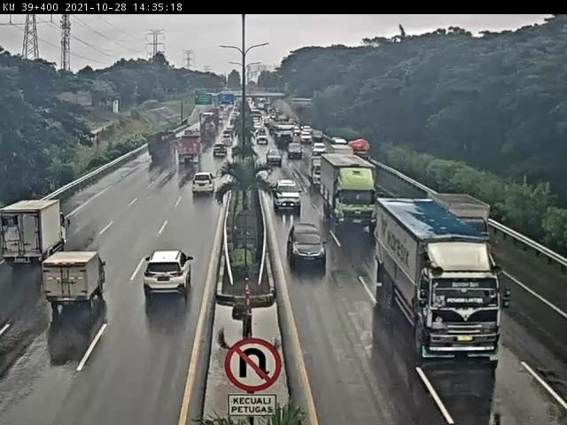
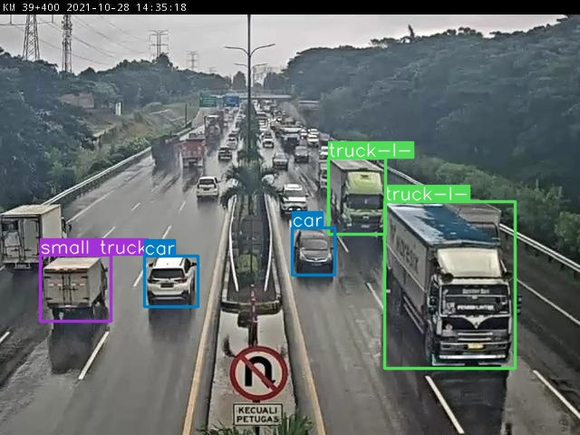
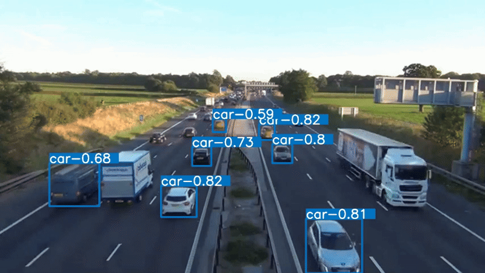

# Car Detection by YOLO8

## Resource
- [Basketball detection](https://github.com/ericstar20/ML_BasketBall_Detect)  
- [How to Train a YOLOv8 Oriented Bounding Boxes Model](https://colab.research.google.com/github/roboflow-ai/notebooks/blob/main/notebooks/train-yolov8-obb.ipynb)  
- [Dataset of cars](https://universe.roboflow.com/roboflow-100/vehicles-q0x2v)

## Description
Detect car on highway using YOLO8n model. Model was pretrained on Colab.

### Input  
Image or video  


### Output 



## Usage

### Clone repo and install requirements
```sh
git clone https://github.com/huhj225131/Car-Detection-YOLO8.git
pip install requirements
```
### For image
```sh
python yolo.py -i <image_path> -y <YOLO_model_path> -c <confidence> -t <threshold>
```

Output: result.jpg
### For video
```sh
python yolo_v.py -v <video_path> -y <YOLO_model_path> -c <confidence> -t <threshold>
```
Output: result.mp4

It has two weights files in YOLO_8 directory, if you want to use new weights, change the file "best.pt" to another name and "best_update.pt" to "best.pt"

